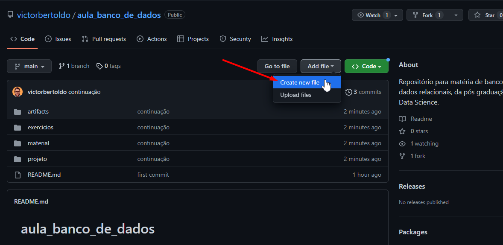
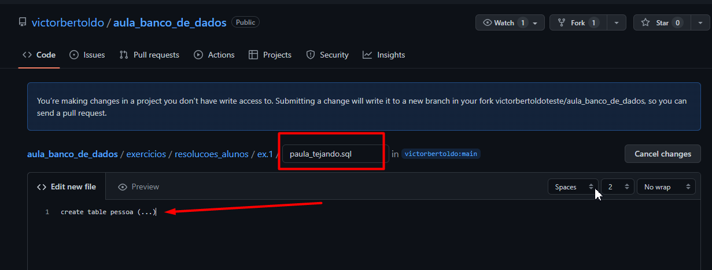
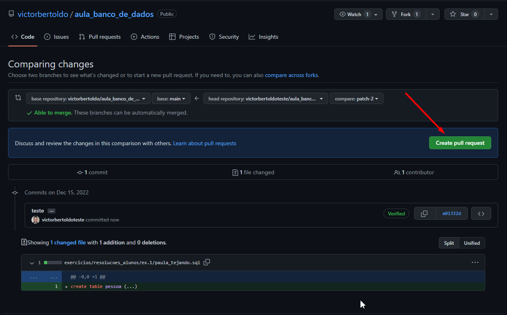

# Exercicio nº 1

### Criação de modelo conceitual para uma loja de reparos de instrumentos.

Utilize o Lucidcharts e exporte o arquivo PDF

## Passos que você deve seguir:
1. Crie o modelo
2. Exporte o modelo em formato PDF
3. Nomeie o arquivo com o seu nome completo separado por '_' exemplo: _getulio_silva_costa.pdf_
>Obs.: O nome completo será utilizado como identificador para geração da sua avaliação geral. Se escrever nomes como _paula_tejando.pdf_, você vai rir, eu vou rir, mas no fim você ficará sem avaliação das atividades em sala.
5. Faça o upload do exercício na respectiva pasta conforme indicado abaixo.

6. Comente qualquer coisa, a próxima etapa haverá a opção de inserir anexos.

7. Escreva uma breve descrição e clique em `Propose new file`.
8. Agora crie um Pull Request

>**Seu PR será revisado após as aulas para formação da sua nota.**

